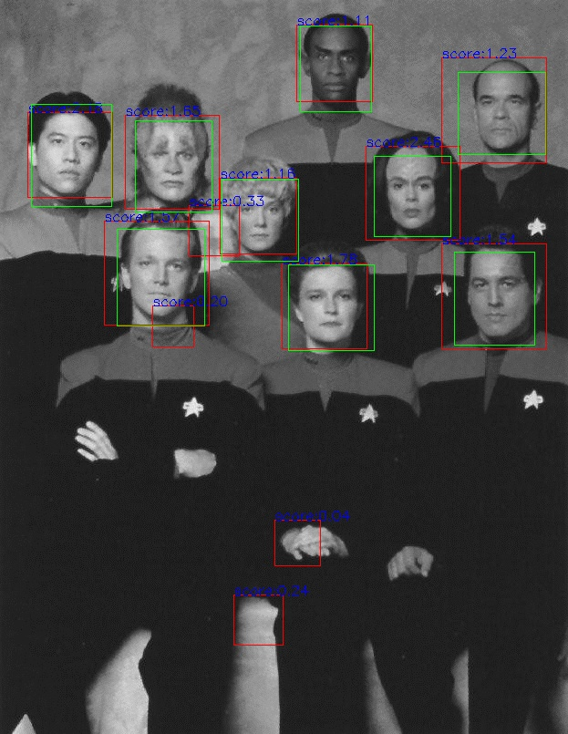
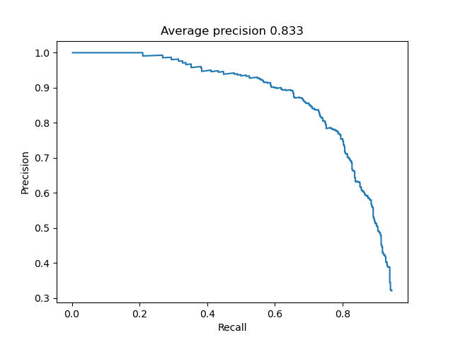

# Face_Detection_HOG

Just another sliding window algorithm to detect faces of variable dimensions using HOG descriptors as input to a SVM model. The dataset can be found here ([Caltech 10, 000 Web Faces](http://www.vision.caltech.edu/Image_Datasets/Caltech_10K_WebFaces/)). Using data augmentation, tuning some paramters such as the hog cell size, the downscale factor for the sliding window and the detection threshold I managed to achieve a mAP of 0.833.

